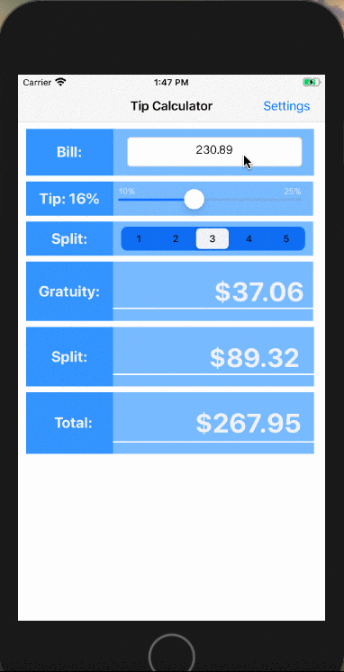

# Tip-Calculator-Application

### Purpose
Tip Calculator Application is an app that allows the user to input a bill in USD and select a desired tip percentag and an optional split between people to be calculated. 
The app will return total gratuity, the amount that should be split between the number of people inputted, and the total bill with added gratuity.  

### Motivation
This is my beginner's attempt at developing a mobile app and understanding Swift syntax. It is part of an application for the CodePath iOS course (Fall 2020). 

## Demo
[Click here](https://recordit.co/hTnbjzxbHH) to watch 

!

-- Built with XCode
